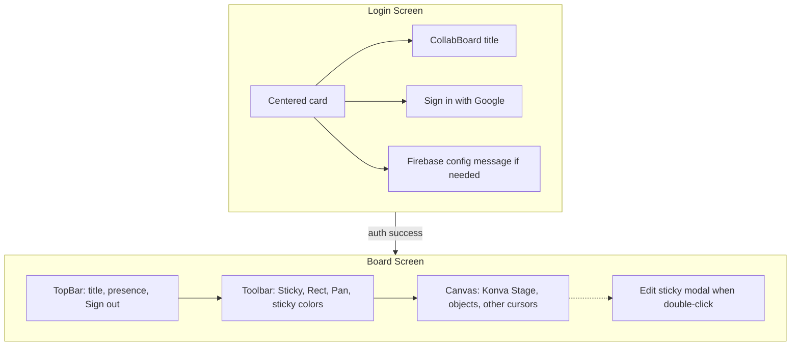

# CollabBoard Design Prototype and 5-Hour MVP Completion Plan

## 1. Design prototype (UI structure)

The app has two main screens. Layout is already implemented in the codebase; this section documents it as the "prototype" for consistency and future reference.

### Screen 1: Login

- **Layout:** Full-viewport centered card on gray background (`#f3f4f6`).
- **Elements:** Title "CollabBoard", "Sign in with Google" primary button, optional Firebase-not-configured message (yellow banner), error text below button if sign-in fails.
- **Flow:** User clicks sign-in → redirects to Google → returns to app; `App` switches to Board when `user` is set.

### Screen 2: Board (post-auth)

- **Layout:** Vertical stack, full height:
  - **TopBar (header):** Left: "CollabBoard" title. Right: presence text (e.g. "Alice, Bob online") and "Sign out" button. White background, bottom border.
  - **Toolbar:** Row of tool buttons (Sticky, Rect, Pan) and, when a sticky is selected, a row of 4 color swatches for sticky color. White background, bottom border.
  - **Canvas (fills remaining space):** Infinite Konva Stage; gray background (`#f3f4f6`). Renders board objects (stickies, rects), other users’ cursors (circle + name label), and handles pan/zoom (wheel) and click-to-add when Sticky/Rect tool is active.
- **Overlay:** When editing a sticky (double-click), a modal: dimmed backdrop, white card with "Edit sticky text", textarea, Cancel/Save. Click outside or Save commits to Firestore.

### Data and interaction (design intent)

- **Objects:** Sticky (text, color, position, size); Rect (position, size, color). Created by tool + click on canvas; moved by drag; sticky text edited via double-click modal; delete via selection + Delete key.
- **Collaboration:** Cursors and presence from Realtime DB; object CRUD from Firestore. All users share one board (`mvp-board-1`). Last-write-wins for conflicts.

No new UI screens are required for MVP; the above is the prototype we are implementing and shipping.

---

## 2. How it is implemented (current codebase)

High-level mapping from design to code:

| Design element                     | Implementation                                                                                                                                                                                      |
| ---------------------------------- | --------------------------------------------------------------------------------------------------------------------------------------------------------------------------------------------------- |
| Auth gate, Loading / Login / Board | [src/App.tsx](src/App.tsx): `user` state, `onAuthStateChanged`, render `LoginPage` or `BoardPage`.                                                                                                  |
| Login screen                       | [src/auth/LoginPage.tsx](src/auth/LoginPage.tsx): layout, `signInWithGoogle()`, Firebase config message, error state.                                                                               |
| TopBar                             | [src/board/TopBar.tsx](src/board/TopBar.tsx): title, `presenceNames`, Sign out.                                                                                                                     |
| Toolbar                            | [src/board/Toolbar.tsx](src/board/Toolbar.tsx): tools (Sticky, Rect, Pan), sticky color picker when `selectedStickyId` set.                                                                         |
| Board state                        | [src/board/BoardPage.tsx](src/board/BoardPage.tsx): `objects` from Firestore subscription, `selectedId`, `editingId`/`editingText`, handlers for delete key, sticky edit save, sticky color change. |
| Canvas                             | [src/canvas/Canvas.tsx](src/canvas/Canvas.tsx): Konva Stage, pan/zoom, cursor broadcast (RTDB), click-to-add stickies/rects, passes `objects`/`selectedId`/callbacks to children.                   |
| Object rendering                   | [src/canvas/BoardObjects.tsx](src/canvas/BoardObjects.tsx): Konva Group/Rect/Text per object; drag-end calls `updateObject`; double-click sticky opens edit flow.                                   |
| Other cursors                      | [src/canvas/OtherCursors.tsx](src/canvas/OtherCursors.tsx): Konva Circle + Text per other user.                                                                                                     |
| Persistence and sync               | [src/firebase/firestore.ts](src/firebase/firestore.ts) (objects), [src/firebase/rtdb.ts](src/firebase/rtdb.ts) (cursors); [src/firebase/config.ts](src/firebase/config.ts) optional Firebase init.  |

Flow: Firestore `subscribeObjects` and RTDB `subscribeCursors` keep local state updated; user actions call `addObject` / `updateObject` / `deleteObject` and cursor setters so all clients see changes. No code changes are required for MVP beyond deployment and verification.

---

## 3. MVP status and 5-hour completion plan

Per [docs/requirements.md](docs/requirements.md), the only unchecked MVP item is:

- **Deployed and publicly accessible**

All other MVP requirements are already implemented (infinite board with pan/zoom, sticky notes with editable text, at least one shape type (rect), create/move/edit objects, real-time sync, multiplayer cursors with names, presence, auth). Completing the MVP section means: (1) deploy the app to Vercel and make it publicly accessible, (2) verify MVP behavior with at least two users, (3) update the requirement doc and README so the deploy item is checked and the live URL is documented.

### 5-hour timebox

| Phase                     | Task                          | Time      | Details                                                                                                                                                                                                                                                                                                                                                                    |
| ------------------------- | ----------------------------- | --------- | -------------------------------------------------------------------------------------------------------------------------------------------------------------------------------------------------------------------------------------------------------------------------------------------------------------------------------------------------------------------------- |
| **1. Deploy**             | Vercel setup and first deploy | 1–1.5 hr  | Create Vercel project (GitHub import or CLI). Add all `VITE_FIREBASE_*` env vars from `.env.example`. Run `npm run build` locally to confirm it passes; deploy. Fix any build or runtime errors (e.g. env prefix, public path).                                                                                                                                            |
| **2. Env and rules**      | Ensure production works       | 30 min    | Confirm Firebase Auth authorized domains include the Vercel domain. Confirm Firestore and Realtime Database rules are deployed and allow authenticated read/write for the paths the app uses.                                                                                                                                                                              |
| **3. MVP verification**   | Two-user and persistence test | 45–60 min | Open deployed URL in two browsers (or one normal + one incognito), sign in as two different Google users. Verify: cursors visible with names, presence in TopBar, create/move/edit/delete sticky and rect, sticky edit modal and color change, pan/zoom. One user refreshes; confirm board state persists. Document any issues.                                            |
| **4. Docs and checklist** | Mark MVP complete             | 30 min    | In [docs/requirements.md](docs/requirements.md), check the "Deployed and publicly accessible" item. In [README.md](README.md), add the deployed URL under a "Live app" or "Deploy" section. Optionally add a one-line "Architecture" note (e.g. React + Konva + Firestore + RTDB) for submission. In [STATUS_AND_PLAN.md](STATUS_AND_PLAN.md), set the deploy row to done. |
| **5. Buffer**             | Fixes and edge cases          | 30–45 min | Address any bugs found in verification (e.g. CORS, auth redirect, blank board). Re-run two-user test if needed.                                                                                                                                                                                                                                                            |

Total: about 4.5–5 hours, with buffer for fixes.

### Out of scope for this 5-hour MVP completion

- Adding circle/line shapes, connectors, resize, multi-select, duplicate, copy/paste (Core whiteboard).
- AI board agent (separate deliverable).
- Pre-Search doc, AI Development Log, AI Cost Analysis (documentation deliverables; no code change required for MVP section).

---

## 4. Deliverables after 5 hours

- **Public URL** that loads the app, allows Google sign-in, and supports real-time board with 2+ users.
- **docs/requirements.md** with "Deployed and publicly accessible" checked.
- **README.md** (and optionally STATUS_AND_PLAN.md) updated with live link and minimal architecture/submission note.
- **Confidence** that MVP section of the requirement doc is complete and demonstrable for the submission (demo video, 5+ users claim).

No design or feature changes are required for MVP; the existing prototype and implementation are sufficient. The 5-hour focus is deployment, verification, and documentation.