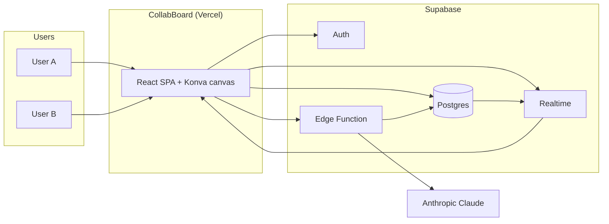
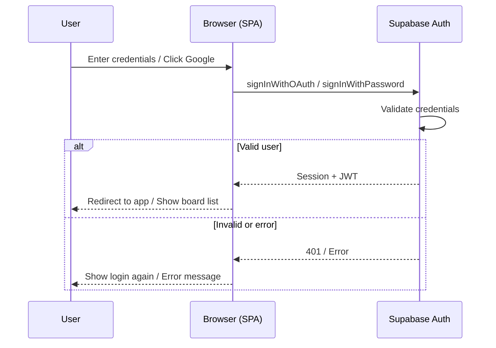
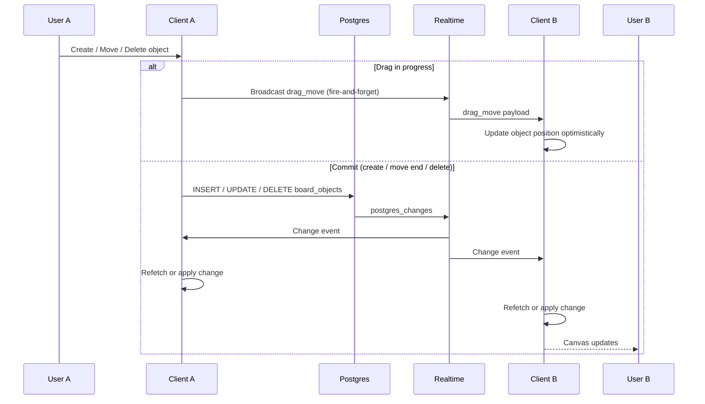
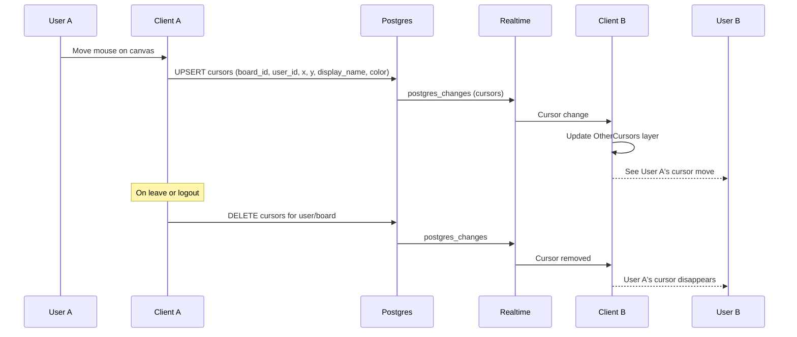
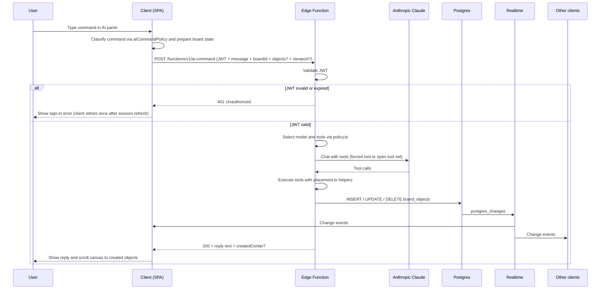
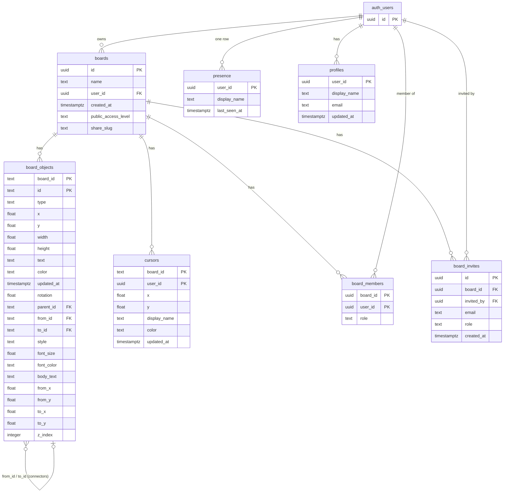

# CollabBoard — Architecture Overview

High-level architecture for the real-time collaborative whiteboard and AI board agent. For stack rationale and trade-offs, see [presearch.md](presearch.md).

---

## 1. System context

Users interact with the CollabBoard web app (hosted on Vercel). The app talks to Supabase for auth, persistence, and real-time sync, and to a Supabase Edge Function that proxies requests to Anthropic's Claude API. The API key never leaves the server.

**Legend:** Solid arrows show primary request/response or data flow. Postgres and Realtime are both inside Supabase; Realtime subscribes to Postgres changes and pushes them to clients.

---

## 2. Stack summary

| Layer | Technology | Role |
|-------|------------|------|
| **Frontend** | React (Vite), Konva.js (`react-konva`) | SPA; infinite canvas, pan/zoom, objects at 60 FPS for 500+ elements. |
| **Hosting** | Vercel | Static build (`dist`); SPA routing via `vercel.json`. |
| **Auth** | Supabase Auth | Google (and email) sign-in; JWT for API and RLS. |
| **Database** | Supabase (PostgreSQL) | `boards`, `board_objects`, `cursors`, `presence`, `board_members`; RLS for per-board and sharing access. |
| **Real-time** | Supabase Realtime | `postgres_changes` for object persistence; Broadcast for high-frequency drag and cursor updates. |
| **AI** | Supabase Edge Function + Anthropic Claude | Edge Function validates JWT, calls Claude (`claude-haiku-4-5-20251001` for fast/bulk, `claude-sonnet-4-20250514` for smart/compound/complex), executes tools server-side, writes to Postgres; all clients see results via Realtime. |

---

## 3. Key flows

The following sections describe each major flow in two ways: **prose** (what happens and why) and a **sequence diagram** (who talks to whom and in what order). In the diagrams, participants are the main actors (User, Client, Supabase services, Claude). Arrows are messages or calls; **alt** blocks show success vs failure or alternative paths.

---

### 3.1 Auth and login flow

Users sign in with **Google** (OAuth) or **email/password** via Supabase Auth. The client never handles passwords for OAuth; for email, it sends credentials to Supabase and receives a session. The JWT from that session is used for all subsequent API calls (Postgres, Realtime, Edge Function) and for Row Level Security (RLS). On sign-out, the client calls `signOut()` and the app returns to the login screen.

**Notes:** For Google, the user is redirected to Google and back; Supabase exchanges the code for a session. For email, validation is done entirely by Supabase Auth. The client subscribes to `onAuthStateChange` so the UI updates when the session is refreshed or the user signs out.

---

### 3.2 Object sync (create, move, resize, delete)

The client mutates board state by inserting, updating, or deleting rows in `board_objects` via the Supabase client. Postgres triggers Realtime `postgres_changes`; every subscribed client receives the change and updates the canvas. Writes are keyed by `board_id` and object `id`. Conflict strategy: **last-write-wins** (Postgres `updated_at`); simultaneous edits from multiple users result in the latest write winning. There is no operational transform or CRDT.

**During drag:** To avoid flooding Postgres with updates on every mouse move, the client sends drag position over a **Broadcast** channel (same Realtime channel, event `drag_move`). Other clients apply the move optimistically. On **drag end**, the client writes the final position once to `board_objects`; that single write is synced to all clients via `postgres_changes`.

**Notes:** All clients subscribe to `postgres_changes` on `board_objects` filtered by `board_id`. Refetch is debounced (e.g. 4 s) so rapid remote changes don't cause excessive reads; individual change events can be applied in memory when provided.

---

### 3.3 Cursor and presence flow

Cursor position and presence (who is on the board) are updated frequently. The client calls `setMyCursor` which **upserts** a row in the `cursors` table (one row per user per board). Supabase Realtime broadcasts `postgres_changes` on `cursors`, so other clients receive cursor moves and display them (with display name and color). No Broadcast channel is used for cursors in the current design; the `cursors` table is the source of truth and Realtime keeps latency low. **Presence** (who is logged in globally) uses the `presence` table and a heartbeat; the Top Bar subscribes to presence to show "who's online." On disconnect or logout, the client removes its cursor row(s) so other users see the cursor disappear.

**Notes:** Cursors are keyed by `(board_id, user_id)`. Presence uses a separate `presence` table and heartbeat; the "Online" dropdown and Top Bar presence list come from subscribing to presence and optionally cursors per board.

---

### 3.4 AI command flow

The user types a natural-language command in the AI panel. Before sending, the client runs `aiCommandPolicy.ts` (a mirror of the edge-function policy) to classify the command and decide how much board state to send:

- **Simple creation** (e.g. "add a sticky note") — `boardStateForPlacementOnly: true`; objects are sent for server-side overlap avoidance but are not injected into the Claude prompt, saving tokens.
- **Bulk creation** (e.g. "create 20 stickies") — same flag; forced to `createBulkObjects` compound tool.
- **Compound templates** (SWOT, retro, kanban, flowchart) — no board state in prompt; server lays out everything in one tool call.
- **Ops commands** (move, delete, recolor, …) on boards ≤ 25 objects — full board state sent inline so Claude acts in one turn without a `getBoardState` round-trip.
- **Query / complex** — full board state sent; Claude may call `getBoardState` server-side for large boards (>200 objects returns a frame-only summary).

The request also carries the current **viewport bounds** so the edge function's `placement.ts` helpers can resolve non-overlapping positions within the visible area.

The Edge Function validates the JWT, selects model and tools per `policy.ts` (`claude-haiku-4-5-20251001` for fast/bulk, `claude-sonnet-4-20250514` for smart/compound/complex), then runs a tool loop. Tool execution is server-side: the Edge Function inserts/updates/deletes in Postgres. Those Postgres changes flow to all clients via Realtime so **shared AI state** is achieved without the client ever holding the Anthropic API key. The response optionally includes `createdCenter` so the client can auto-scroll the viewport to show the result.

**Tools available to Claude:** `getBoardState`, `createStickyNote`, `createShape`, `createFrame`, `createConnector`, `createText`, `moveObject`, `resizeObject`, `rotateObject`, `updateText`, `changeColor`, `deleteObject`, `arrangeInGrid`, `createBulkObjects`, `createQuadrant`, `createColumnLayout`, `createFlowchart`, `clearBoard`, `batchModify`. The `batchModify` tool updates or deletes a set of objects in one Postgres call, avoiding per-object round-trips for batch operations.

**Notes:** The `returnAfterToolExecution` policy flag controls whether the edge function returns immediately after the first mutation turn (fast path for simple/bulk/compound) or continues the Claude loop for multi-step complex commands. `getBoardState` is excluded from the tool list when `allowGetBoardState` is false, preventing unnecessary DB reads on creation-only commands. The client refreshes its session token and retries once on 401 before surfacing an error.

---

## 4. Data model (entity relationship)

The following diagram summarizes the main tables and their relationships. All tables live in Postgres; RLS and Realtime are configured per table as described in the schema and DEPLOY docs.

**Summary:**

| Table | Purpose |
|-------|---------|
| **boards** | One row per whiteboard; owned by `user_id`; optional `share_slug` and `public_access_level` for sharing. |
| **board_objects** | One row per canvas object (sticky, rect, circle, line, frame, connector, text). Extended columns: `rotation`, `parent_id` (frame containment), `from_id`/`to_id`/`style`/`from_x`/`from_y`/`to_x`/`to_y` (connectors with draggable endpoints), `font_size`/`font_color` (text objects), `body_text` (frame body), `z_index` (render layer order). |
| **cursors** | One row per user per board; position and display name for multiplayer cursors; Realtime pushes updates. |
| **presence** | One row per logged-in user; global "who's online"; heartbeat and optional cleanup via `prune_stale_presence()`. |
| **board_members** | Sharing: which users have access to a board (owner, editor, viewer). Populated automatically by trigger on board insert. |
| **board_invites** | Pending invites by email until the invitee signs up; `invited_by` tracks who sent the invite. |
| **profiles** | Display name and email for invite-by-email lookup and "People with access" UI; upserted on login. |

---

## 5. Code layout

Feature-oriented structure under `src/`:

| Path | Purpose |
|------|---------|
| `auth/` | Login page, sign-in/sign-out; Supabase Auth. |
| `board/` | Board list, board canvas page, toolbar, top bar, share modal. |
| `canvas/` | Konva stage and layers; `BoardObjects` (render objects from DB); `OtherCursors` (multiplayer cursor layer); `selectionRect` (marquee selection helpers); `placementUtils` (client-side overlap avoidance for new objects). |
| `ai/` | `claudeAgent.ts` (call Edge Function, smart board-state routing, viewport, retry on 401); `aiCommandPolicy.ts` (client policy mirror for command classification). |
| `supabase/` | Config, auth helpers; `boards`, `objects`, `cursors`, `presence`, `boardMembers`, `dragBroadcast`; Realtime subscriptions. |
| `types/` | Shared TypeScript types (`BoardObject`, `AppUser`, `ConnectorStyle`). |
| `constants.ts` | Shared size/color/timing constants (imported by both canvas and board modules). |
| `utils/` | Input validation and sanitisation helpers. |

Edge Function (separate from Vite app):

| Path | Purpose |
|------|---------|
| `supabase/functions/ai-command/index.ts` | Request handler; JWT validation; Claude tool loop; tool executors for all 20 tools. |
| `supabase/functions/ai-command/policy.ts` | Message → model tier, tool set, max turns, `returnAfterToolExecution` flag. |
| `supabase/functions/ai-command/placement.ts` | `resolvePlacement` / `resolveBulkPlacement` — non-overlapping position resolution using existing objects and viewport bounds. |

---

## 6. Decisions (summary)

| Decision | Choice | Rationale (details in [presearch](presearch.md)) |
|----------|--------|--------------------------------------------------|
| Canvas | Konva.js | Balance of speed and DX; 60 FPS @ 500+ objects; high-level shapes/transforms. |
| Backend / DB / Realtime | Supabase (Postgres + Realtime) | Single BaaS for auth, SQL, and real-time; Broadcast &lt;10 ms; RLS for security. |
| AI proxy | Supabase Edge Function | Keeps Anthropic API key server-side; JWT validation before calling Claude. |
| AI models | `claude-haiku-4-5-20251001` (fast/bulk) + `claude-sonnet-4-20250514` (smart/compound/complex) | Haiku for latency-sensitive single-object and bulk creation; Sonnet for multi-step, templates, and ops requiring board-state reasoning. |
| Compound tools | Server-side layout (`createQuadrant`, `createColumnLayout`, `createFlowchart`, `createBulkObjects`) | One LLM call → many inserts; avoids N round-trips and rate limits. |
| Batch operations | `batchModify` tool | Move/delete/recolor many objects in one Postgres call; avoids per-object tool loops. |
| Smart board-state routing | `boardStateForPlacementOnly` flag + 25-object ops threshold | Minimises Claude input tokens: creation tools get placement data without filling the prompt; small boards send inline state to skip a `getBoardState` round-trip. |
| Conflicts | Last-write-wins | Documented and acceptable per G4; no OT/CRDT for MVP. |

For full pre-search checklist, trade-offs, and Phase 1–3 notes, see [presearch.md](presearch.md).
