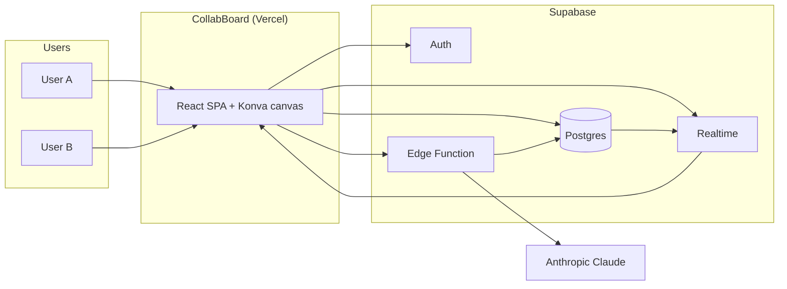
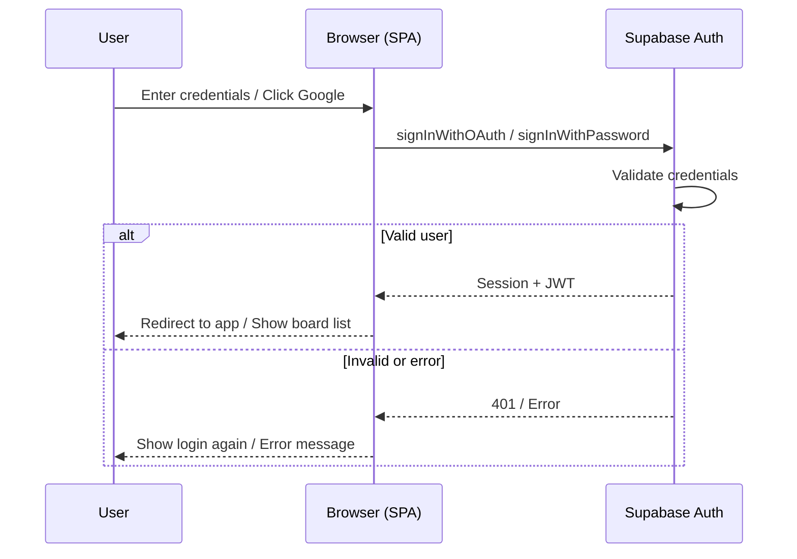
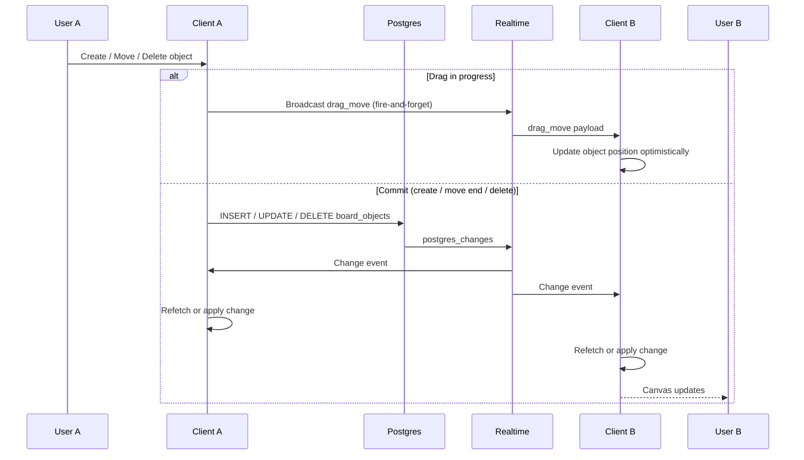
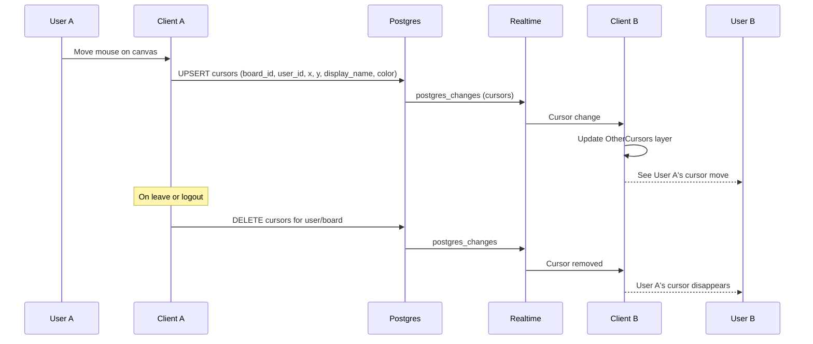

# CollabBoard — Architecture Overview

High-level architecture for the real-time collaborative whiteboard and AI board agent. For stack rationale and trade-offs, see [presearch.md](presearch.md).

---

## 1. System context

Users interact with the CollabBoard web app (hosted on Vercel). The app talks to Supabase for auth, persistence, and real-time sync, and to a Supabase Edge Function that proxies requests to Anthropic’s Claude API. The API key never leaves the server.



**Legend:** Solid arrows show primary request/response or data flow. Postgres and Realtime are both inside Supabase; Realtime subscribes to Postgres changes and pushes them to clients.

---

## 2. Stack summary

| Layer | Technology | Role |
|-------|------------|------|
| **Frontend** | React (Vite), Konva.js (`react-konva`) | SPA; infinite canvas, pan/zoom, objects at 60 FPS for 500+ elements. |
| **Hosting** | Vercel | Static build (`dist`); SPA routing via `vercel.json`. |
| **Auth** | Supabase Auth | Google (and email) sign-in; JWT for API and RLS. |
| **Database** | Supabase (PostgreSQL) | `boards`, `board_objects`, `cursors`, `presence`, `board_members`; RLS for per-board and sharing access. |
| **Real-time** | Supabase Realtime | `postgres_changes` for object persistence; Broadcast for high-frequency drag and cursor updates. |
| **AI** | Supabase Edge Function + Anthropic Claude | Edge Function validates JWT, calls Claude (Haiku or Sonnet), runs tools, writes to Postgres; all clients see results via Realtime. |

---

## 3. Key flows

The following sections describe each major flow in two ways: **prose** (what happens and why) and a **sequence diagram** (who talks to whom and in what order). In the diagrams, participants are the main actors (User, Client, Supabase services, Claude). Arrows are messages or calls; **alt** blocks show success vs failure or alternative paths.

---

### 3.1 Auth and login flow

Users sign in with **Google** (OAuth) or **email/password** via Supabase Auth. The client never handles passwords for OAuth; for email, it sends credentials to Supabase and receives a session. The JWT from that session is used for all subsequent API calls (Postgres, Realtime, Edge Function) and for Row Level Security (RLS). On sign-out, the client calls `signOut()` and the app returns to the login screen.



**Notes:** For Google, the user is redirected to Google and back; Supabase exchanges the code for a session. For email, validation is done entirely by Supabase Auth. The client subscribes to `onAuthStateChange` so the UI updates when the session is refreshed or the user signs out.

---

### 3.2 Object sync (create, move, resize, delete)

The client mutates board state by inserting, updating, or deleting rows in `board_objects` via the Supabase client. Postgres triggers Realtime `postgres_changes`; every subscribed client receives the change and updates the canvas. Writes are keyed by `board_id` and object `id`. Conflict strategy: **last-write-wins** (Postgres `updated_at`); simultaneous edits from multiple users result in the latest write winning. There is no operational transform or CRDT.

**During drag:** To avoid flooding Postgres with updates on every mouse move, the client sends drag position over a **Broadcast** channel (same Realtime channel, event `drag_move`). Other clients apply the move optimistically. On **drag end**, the client writes the final position once to `board_objects`; that single write is synced to all clients via `postgres_changes`.



**Notes:** All clients subscribe to `postgres_changes` on `board_objects` filtered by `board_id`. Refetch is debounced (e.g. 4 s) so rapid remote changes don’t cause excessive reads; individual change events can be applied in memory when provided.

---

### 3.3 Cursor and presence flow

Cursor position and presence (who is on the board) are updated frequently. The client calls `setMyCursor` which **upserts** a row in the `cursors` table (one row per user per board). Supabase Realtime broadcasts `postgres_changes` on `cursors`, so other clients receive cursor moves and display them (with display name and color). No Broadcast channel is used for cursors in the current design; the `cursors` table is the source of truth and Realtime keeps latency low. **Presence** (who is logged in globally) uses the `presence` table and a heartbeat; the Top Bar subscribes to presence to show “who’s online.” On disconnect or logout, the client removes its cursor row(s) so other users see the cursor disappear.



**Notes:** Cursors are keyed by `(board_id, user_id)`. Presence uses a separate `presence` table and heartbeat; the “Online” dropdown and Top Bar presence list come from subscribing to presence and optionally cursors per board.

---

### 3.4 AI command flow

The user types a natural-language command in the AI panel. The client optionally sends the current board state (depending on command type: bulk creation sends no state; query and manipulation send state), then POSTs to the Edge Function with the Supabase JWT. The Edge Function validates the JWT, calls Claude with the appropriate tool set and model (Haiku for simple/bulk, Sonnet for compound/complex), and executes tool calls (e.g. `createStickyNote`, `createQuadrant`, `createBulkObjects`). Tool execution is server-side: the Edge Function inserts/updates/deletes in Postgres. Those Postgres changes flow to all clients via Realtime, so **shared AI state** is achieved without the client ever holding the Anthropic API key.

```mermaid
sequenceDiagram
  participant User
  participant Client as Client (SPA)
  participant EF as Edge Function
  participant Claude as Anthropic Claude
  participant PG as Postgres
  participant RT as Realtime
  participant Other as Other clients

  User->>Client: Type command in AI panel
  Client->>Client: Optionally attach current board state (or empty for bulk)
  Client->>EF: POST /functions/v1/ai-command (JWT + message + boardId + objects?)
  EF->>EF: Validate JWT
  alt JWT invalid or expired
    EF-->>Client: 401 Unauthorized
    Client-->>User: Show "Sign in again" or error
  else JWT valid
    EF->>Claude: Chat with tools (createStickyNote, createBulkObjects, etc.)
    Claude-->>EF: Tool calls
    EF->>EF: Execute tools (e.g. batch insert)
    EF->>PG: INSERT / UPDATE / DELETE board_objects
    PG->>RT: postgres_changes
    RT->>Client: Change events
    RT->>Other: Change events
    EF-->>Client: 200 + reply text
    Client-->>User: Show reply; canvas already updated via Realtime
  end
```

**Notes:** The client may retry once on 401 after refreshing the session. Bulk creation uses a single compound tool so the server computes all positions in one go; no board state is sent. Query commands (e.g. “how many stickies?”) send board state so Claude can answer or call `getBoardState` if needed.

---

## 4. Data model (entity relationship)

The following diagram summarizes the main tables and their relationships. All tables live in Postgres; RLS and Realtime are configured per table as described in the schema and DEPLOY docs.

```mermaid
erDiagram
  boards ||--o{ board_objects : "has"
  boards ||--o{ cursors : "has"
  boards ||--o{ board_members : "has"
  boards ||--o{ board_invites : "has"

  auth_users ||--o{ boards : "owns"
  auth_users ||--o{ presence : "one row"
  auth_users ||--o{ board_members : "member of"
  auth_users ||--o{ profiles : "has"

  board_objects }o--o| board_objects : "parent_id (frames)"
  board_objects }o--o| board_objects : "from_id / to_id (connectors)"

  auth_users {
    uuid id PK
  }

  boards {
    uuid id PK
    text name
    uuid user_id FK
    timestamptz created_at
    text public_access_level
    text share_slug
  }

  board_objects {
    text board_id PK,FK
    text id PK
    text type
    float x y width height
    text text color
    timestamptz updated_at
    text parent_id FK
    text from_id to_id FK
  }

  cursors {
    text board_id PK,FK
    uuid user_id PK
    float x y
    text display_name color
    timestamptz updated_at
  }

  presence {
    uuid user_id PK
    text display_name
    timestamptz last_seen_at
  }

  board_members {
    uuid board_id PK,FK
    uuid user_id PK,FK
    text role
  }

  board_invites {
    uuid id PK
    uuid board_id FK
    text email
    text role
  }

  profiles {
    uuid id PK,FK
    text display_name
    text email
  }
```

**Summary:**

| Table | Purpose |
|-------|---------|
| **boards** | One row per whiteboard; owned by `user_id`; optional `share_slug` and `public_access_level` for sharing. |
| **board_objects** | One row per object on a board (sticky, rect, circle, frame, connector, text); `parent_id` for frames; `from_id`/`to_id` for connectors. |
| **cursors** | One row per user per board; position and display name for multiplayer cursors; Realtime pushes updates. |
| **presence** | One row per logged-in user; global “who’s online”; heartbeat and optional cleanup. |
| **board_members** | Sharing: which users have access to a board (owner, editor, viewer). |
| **board_invites** | Pending invites by email until the invitee signs up. |
| **profiles** | Display name and email for lookup and “People with access” UI. |

---

## 5. Code layout

Feature-oriented structure under `src/`:

| Path | Purpose |
|------|---------|
| `auth/` | Login page, sign-in/sign-out; Supabase Auth. |
| `board/` | Board list, board canvas page, toolbar, top bar, share modal. |
| `canvas/` | Konva stage and layers; `BoardObjects` (render objects from DB); selection rect; other users’ cursors. |
| `ai/` | `claudeAgent.ts` (call Edge Function); `aiCommandPolicy.ts` (client policy mirror for board-state routing). |
| `supabase/` | Config, auth helpers; `boards`, `objects`, `cursors`, `presence`, `boardMembers`, `dragBroadcast`; Realtime subscriptions. |
| `types/` | Shared TypeScript types (e.g. `BoardObject`, `AppUser`). |
| `utils/` | Input validation and helpers. |

Edge Function (separate from Vite app):

| Path | Purpose |
|------|---------|
| `supabase/functions/ai-command/` | `index.ts` (request handler, Claude loop, tool execution); `policy.ts` (message → model tier, tools, turns). |

---

## 6. Decisions (summary)

| Decision | Choice | Rationale (details in [presearch](presearch.md)) |
|----------|--------|--------------------------------------------------|
| Canvas | Konva.js | Balance of speed and DX; 60 FPS @ 500+ objects; high-level shapes/transforms. |
| Backend / DB / Realtime | Supabase (Postgres + Realtime) | Single BaaS for auth, SQL, and real-time; Broadcast &lt;10 ms; RLS for security. |
| AI proxy | Supabase Edge Function | Keeps Anthropic API key server-side; JWT validation before calling Claude. |
| AI models | Haiku (simple/bulk) + Sonnet (compound/ops/complex) | Latency &lt;2 s for simple; Sonnet for multi-step and templates; cost control. |
| Compound tools | Server-side layout (e.g. `createQuadrant`, `createBulkObjects`) | One LLM call → many inserts; avoids N round-trips and rate limits. |
| Conflicts | Last-write-wins | Documented and acceptable per G4; no OT/CRDT for MVP. |

For full pre-search checklist, trade-offs, and Phase 1–3 notes, see [presearch.md](presearch.md).
